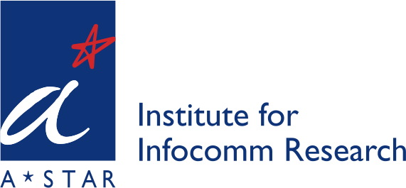

# The MFoM Framework for Speech Attribute Detection




[The SIPU Lab / University of Eastern Finland](https://www.uef.fi/web/machine-learning) 

[Institute for Infocomm Research / A*Star / Singapore](https://www.a-star.edu.sg/i2r)

Author: **Ivan Kukanov**, [Email](mailto:ivan@kukanov.com), [Homepage](http://www.kukanov.com), [GitHub](https://github.com/vanova)

Supervisor: **Ville Hautamäki**, [Email](mailto:villeh@uef.fi), [Homepage](http://cs.joensuu.fi/~villeh/)

Collaborator: **Sabato Marco Siniscalchi**, [Homepage](https://www.unikore.it/index.php/it/ingegneria-informatica-persone/docenti-del-corso/itemlist/category/1589-siniscalchi)

Collaborator: **Kong Aik Lee**, [Homepage](https://sites.google.com/site/kongaikleesg/home)

About
=====
This python framework represents the implementation of the [maximal figure-of-merit](http://cs.joensuu.fi/~villeh/slt_2016.pdf) (MFoM) 
approach for approximation of discrete performance measures: F1-score (micro/macro), EER, DCF (detection cost function).  
In particular, it is applied for the speech articulatory attributes detection, such as manner and place of articulation: *fricative, glide, 
nasal, stop, vowel, voiced, coronal, dental, glottal, high, labial, low, middle, palatal and velar*. Those articulatory attributes can 
be extracted from a speech signal and considered as a universal phonetic speech features. The application of these features is diverse: 
foreign accent detection, automatic speech recognition, spoken language recognition, e.t.c.

**Note** this project is based on the ***stories*** subset of the [**OGI Multi-language Telephone Speech**](http://citeseerx.ist.psu.edu/viewdoc/summary?doi=10.1.1.40.7091) 
corpus. We are not allowed to publish it here, because of the licence reason. 
You may check another project with the MFoM framework on the open dataset: [Multi-label MFoM framework for DCASE 2016: Task 4](https://github.com/Vanova/mfom_dcase16_task4). 

The proposed MFoM approaches are used in the series of works
 
* [Maximal Figure-of-Merit Embedding for Multi-label Audio Classification](http://cs.joensuu.fi/~villeh/MFoM-ICASSP2017.pdf)
* [Recurrent Neural Network and Maximal Figure of Merit for Acoustic Event Detection](http://www.cs.tut.fi/sgn/arg/dcase2017/documents/challenge_technical_reports/DCASE2017_Kukanov_196.pdf)
* [Deep learning with Maximal Figure-of-Merit Cost to Advance Multi-label Speech Attribute Detection](http://cs.joensuu.fi/~villeh/slt_2016.pdf)
* [Boosting Universal Speech Attributes Classification with Deep Neural Network for Foreign Accent Characterization](https://bioinformatics.uef.fi/~hamidbeh/pdfs/Interspeech2015_boosting.pdf)
* [Speech Attribute Detection Using Deep Learning](http://cs.uef.fi/sipu/pub/SpeechAtrib-Kukanov.pdf)

Another implementations

* [Multi-label MFoM framework for DCASE 2016: Task 4](https://github.com/Vanova/mfom_dcase16_task4)
* [MULAN-LRE project](https://github.com/Vanova/MULAN-LRE) Used during the NIST LRE 2015 challenge, includes **KALDI trained models**.


Table of Contents
=================
<!-- ⛔️ MD-MAGIC-EXAMPLE:START (TOC:collapse=true&collapseText=Click to expand) -->
<details>
<summary>Click to expand</summary>

- [About](#about)
- [Install](#install)
- [Usage](#usage)
- [The MFoM approaches](#the-mfom-approaches)
- [System parameters](#system-parameters)
- [Changelog](#changelog)
- [Citation](#citation)
- [License](#license) 

</details>
<!-- ⛔️ MD-MAGIC-EXAMPLE:END -->


Install
==========
[back to the TOC](#table-of-contents)

The system is developed for [Python 2.7](https://www.python.org/). 
Currently, the baseline systems are tested only with Linux operating systems.

You may install the python environment using [Conda](https://conda.io/docs/) and the yml setting file:

`$ conda env create -f envs/conda/ai.py2.yml`

and activate the environment 

`$ source activate ai`

Specifically the project is working with [Keras 2.0.2](https://keras.io/), [Tensorflow-GPU 1.4.1](https://www.tensorflow.org/).


Usage
=====
[back to the TOC](#table-of-contents)

The executable file of the project is: `experiments/run_ogits.py`
The system has two pipeline operating modes: *Development mode* and *Submission (or evaluation) mode* (TBD). 
The usage parameters are shown by executing `python run_ogits.py -h`.
The system parameters are defined in `experiments/params/ogits.yaml`. 

The main code of the project is in the `src` folder, see the [description](./src/README.md) of the packages.

#### Development mode

In this mode the system is trained and tested with the development dataset. 
This is the default operating mode. In order to run the system in this mode:

`python run_ogits.py -m dev -p params/ogits.yaml -a manner`,

where the parameter `-a` can have the values `manner`, `place` or `fusion`.


The MFoM approaches
=====================
[back to the TOC](#table-of-contents)

In this project we release bunch of MFoM approaches. These are *MFoM-microF1*, *MFoM-macroF1*, *MFoM-EER*, *MFoM-Cprime*, *MFoM-embedding*. 
These approaches allow to optimize the performance metrics directly versus indirect optimization approaches with MSE, 
cross-entropy, binary cross-entropy and other objective functions. The implementation of the MFoM objective functions and 
layers see in `src/model/objectives.py` and `src/model/mfom.py`.
**Also**, you may want check a simple example with the MFoM in `tests/model/test_mfom_2d.py`


System parameters
==================
[back to the TOC](#content)

The parameters of the system are in `experiments/params/ogits.yaml`.
It contains the next blocks. 

**Controlling the system pipeline flow**

The pipeline of the system can be controlled through the configuration file.  
    
    pipeline:
        init_dataset: true
        extract_features: true
        search_hyperparams: false
        train_system: true
        test_system: true

**General parameters**

Dataset and experiment general settings

    experiment:
        name: ogits
        development_dataset: <path to the OGI-TS development dataset>
        submission_dataset: <path to the submission dataset>
        lists_dir: <path to the original meta data of the dataset>
        attribute_class: place # or manner, fusion

**System paths**

This section contains the storage paths of the trained systems.
*Note* by default all the system files (features, trained models) are not 
overwritten in consecutive running, you need either manually delete files or
apply parameter `--overwrite`.

     path:
        base: system/
        meta: meta_data/
        logs: logs/
        features: features/
        models: models/
        hyper_search: hyper_search/
        train_result: train_results/
        submission: submissions/
    
These parameters defines the folder-structure to store acoustic features, 
trained acoustic models and store results.

**Feature extraction**

This section contains the feature extraction related parameters. 

    features:
      type: fbank    
      fbank:
        bands: 96
        fmax: 4000 # sample rate 8000Hz / 2
        fmin: 0
        hop_length_seconds: 0.02
        htk: false
        include_delta: false
        include_acceleration: false
        mono: true
        n_fft: 512
        window: hamming_asymmetric
        win_length_seconds: 0.04
        delta:
          width: 9
        acceleration:
          width: 9

We can define several types of features and specify the particular features 
in the parameter `type`. Currently we use log Mel-filter banks (`type: fbank`).

**Model settings**

This is the model settings for pre-training and fine-tune.  
*Note* after changing any parameters the previous model will not be deleted, but
new path with new hash will be generated.

    model:
        type: sed_ogits        
        sed_ogits:
            do_pretrain: true
            do_finetune: true
            pretrain_set:
              metrics: [class_wise_eer, pooled_eer, micro_f1]
              activation: elu
              batch: 32
              batch_type: sed_sequence  # or sed_random_crop, see src/data_loader/ogits.py
              context_wnd: 128          # frame context
              dropout: 0.1
              feature_maps: 96
              loss: binary_crossentropy # or mfom_eer_normalized, mfom_microf1, pooled_mfom_eer, mfom_cprime, see src/model/objectives.py
              learn_rate: 0.0001
              n_epoch: 400
              optimizer: adam
              out_score: sigmoid
        
            finetune_set:
              activation: elu
              metrics: [class_wise_eer, pooled_eer, micro_f1]
              batch: 32
              batch_type: sed_sequence  # or sed_random_crop
              context_wnd: 128
              dropout: 0.1
              freeze_wt: false
              feature_maps: 96
              loss: mfom_eer_normalized # see src/model/objectives.py
              learn_rate: 0.0001
              n_epoch: 400
              optimizer: adam # or adadelta
              out_score: tanh
              
We can define several types of models and specify the particular model 
in the parameter `type`. Currently we use sound event detection (SED) model (`type: sed_ogits`). 
We can specify either we do model pre-training and tuning or only pre-training (`do_pretrain: true` and `do_finetune: false`).
We can choose several metrics to calculate and monitor during training (`metrics: [class_wise_eer, pooled_eer, micro_f1]`), 
see `src/train/ogits.py`.

**Trainer and callbacks settings**

Set up parameters for metric of performance for monitoring, learning rate schedule,
 early stopping, tensorboard settings.

    callback:
      monitor: class_wise_eer # micro_f1
      mode: min # or max for micro_f1
      chpt_save_best_only: true
      chpt_save_weights_only: true
      lr_factor: 0.5
      lr_patience: 20
      lr_min: 0.000001
      estop_patience: 25
      tensorboard_write_graph: true

Changelog
=========
[back to the TOC](#table-of-contents)

#### 0.0.1 / 2019-02-01

* First public release

Citation
========
[back to the TOC](#table-of-contents)

If you use the code or materials of this project, please cite as
```bibteh
@inproceedings{DBLP:conf/slt/KukanovHSL16,
  author    = {Ivan Kukanov and Ville Hautam{\"{a}}ki and
               Sabato Marco Siniscalchi and Kehuang Li},
  title     = {Deep learning with maximal figure-of-merit cost to advance multi-label
               speech attribute detection},
  booktitle = {2016 {IEEE} Spoken Language Technology Workshop, {SLT} 2016, San Diego,
               CA, USA, December 13-16, 2016},
  pages     = {489--495},
  year      = {2016},
  doi       = {10.1109/SLT.2016.7846308}
}
```

License
=======

This software is released under the terms of the [MIT License](./LICENSE).
