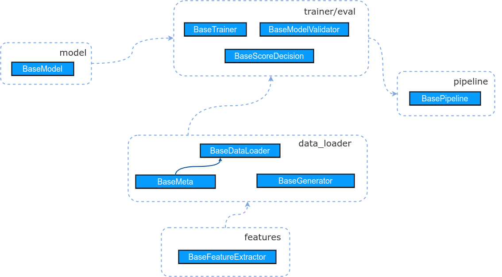

# The MFoM Framework for Speech Attribute Detection
-------------------------------------------------

Project architecture
=============================

The main abstract classes are in `base` folder. The implementations of the abstract classes 
are in the corresponding folders.  




Structure of packages
=====================

```
├── README.md
├── base
│   ├── data_loader.py
│   ├── feature.py
│   ├── model.py
│   ├── pipeline.py
│   └── trainer.py
├── data_loader
│   └── ogits.py
├── features
│   └── speech.py
├── model
│   ├── mfom.py
│   ├── objectives.py
│   └── sed_ogits.py
├── pipeline
│   └── ogits.py
├── trainer
│   ├── ogits.py
│   └── ogits_hyper.py
├── utils
│   ├── config.py
│   ├── dirs.py
│   ├── io.py
│   └── metrics.py
└── visualize
    ├── plot_net.py
    ├── plotter.py
    └── style.py
```

